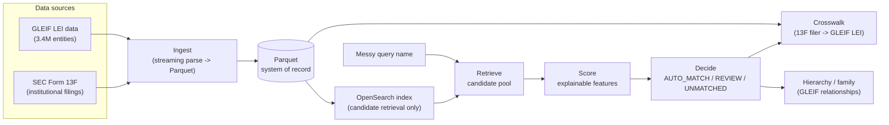

# Institutional Entity Intelligence

Entity-resolution platform anchored on GLEIF LEI data, extended with SEC filing
data (13F institutional holdings), built as a research substrate for
agentic-AI/entity-resolution work. Given a messy, real-world name for a fund or
manager, it identifies the correct legal entity, explains why, and links it to
other identifier systems and its institutional hierarchy.

OpenSearch is used only for candidate retrieval, never as the system of record —
canonical data always lives in Parquet.

## How it works



Every decision carries an evidence trail (which features fired, retrieval score
vs. match score, why a REVIEW/UNMATCHED wasn't confident enough) — never a silent
black box. See [`docs/architecture.md`](docs/architecture.md) for the full
request-level flow and [`docs/phases.md`](docs/phases.md) for the build history.

## Quickstart

**Setup** (once):

```bash
brew install libpostal   # macOS; ships its own trained model data
CFLAGS="-I/opt/homebrew/include" LDFLAGS="-L/opt/homebrew/lib" uv sync
cp .env.example .env     # fill in OPENSEARCH_URL
```

**Data pipeline** (once, or after refreshing raw source files):

```bash
make pipeline        # ingest all sources -> index -> validate -> benchmark
# or step by step:
make ingest-gleif     # GLEIF XML/CSV -> data/processed/*.parquet (~10-15 min)
make ingest-sec-13f   # SEC 13F bulk TSVs -> data/processed/*.parquet (~1 min)
make index            # entities -> OpenSearch (~20 min)
make validate         # sanity-check the processed tables
make benchmark        # data/benchmark/*.parquet (~1 sec, DuckDB)
```

**Day-to-day usage:**

```bash
# Raw candidate search - "what does OpenSearch think this could be"
uv run python -m er.search --name "Sampo Oyj" --country FI

# Full resolution - retrieve + score + decide, with evidence
uv run python -m er.match --name "North Rock Capital" --country GB

# Relationship hierarchy - who manages it, what it's a sub-fund of
uv run python -m er.hierarchy --name "Albacore Partners I Master Fund" --country IE --depth 2

# Brand/family discovery - which SET of legal entities make up this institution
uv run python -m er.family --name "Point72"

# Crosswalk SEC 13F filers to GLEIF LEIs
make crosswalk-sec-13f
```

Run `make help` for the full target list. All CLIs support `--country` (ISO
alpha-2 or a common alias like `UK`/`Cayman Islands`) and `--country-mode
soft|strict`.

## Testing

```bash
make test                                    # unit tests, no live services, ~5s
uv run python -m er.evaluation.run_benchmark  # scores er.match against the full
                                               # benchmark (~7 min, needs live
                                               # OpenSearch) -> evaluation_report.json
```

`make test` covers every pure function (normalization, matcher features/scoring/
decisions, query construction, benchmark generation, graph traversal, brand-core
extraction) against synthetic fixtures — no live services required.
`run_benchmark` is the integration-level check against real data; a `make test`
pass alone doesn't confirm the live system behaves correctly.

## Repo layout

```
src/er/
├── datasources/<source>/   # one folder per data source, owns its own ETL end to end
├── normalisation/          # pure name/address/country normalization
├── retrieval/              # OpenSearch query building + candidate search
├── matching/               # features -> score -> decision (er.match)
├── family/                 # brand/family discovery (er.family)
├── graph/                  # relationship hierarchy (er.hierarchy)
├── crosswalk/              # resolve another source's records to a GLEIF LEI
├── evaluation/             # benchmark scoring + failure-analysis metrics
└── benchmark/              # auto-generated evaluation pairs

experiments/   # proof-backed retrieval/scoring experiments (VALIDATED/INVALIDATED)
docs/          # architecture detail, full phase-by-phase build history
```

More detail: [`AGENTS.md`](AGENTS.md) (repo map + design decisions for anyone —
human or agent — working in this codebase), [`docs/architecture.md`](docs/architecture.md),
[`docs/phases.md`](docs/phases.md), [`experiments/README.md`](experiments/README.md).
