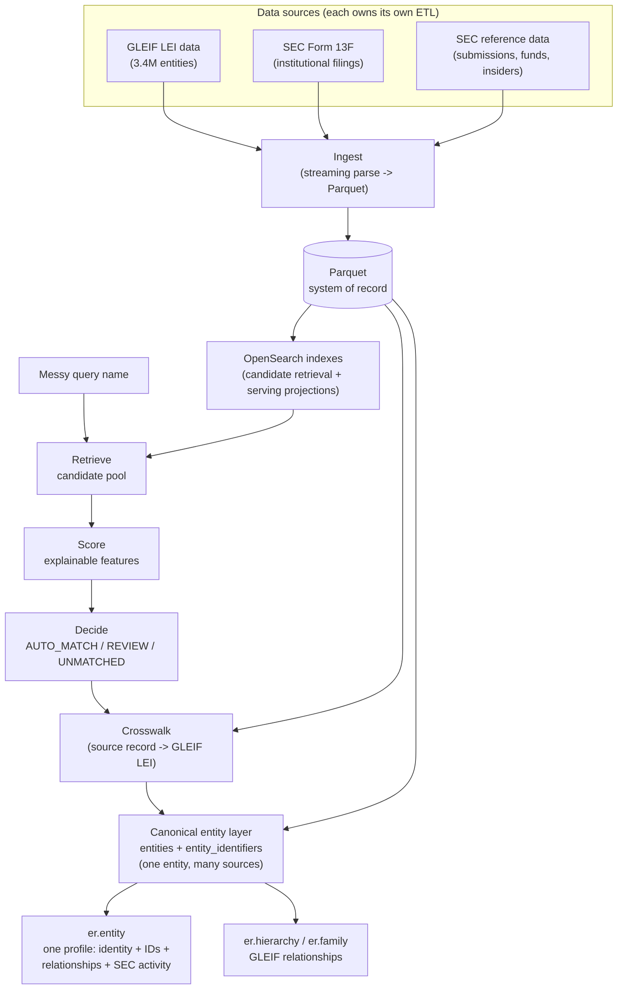
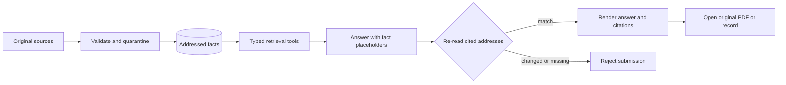

# Institutional Entity Intelligence

Entity-resolution platform anchored on GLEIF LEI data, extended with SEC filing
data (13F and N-PORT holdings, Schedule 13D/G beneficial ownership, fund
registrations, company metadata, and insider transactions), US bank hierarchies
from the FFIEC NIC, and UK Companies House/PSC data, built as a research substrate for
agentic-AI/entity-resolution work. Given a messy, real-world name for a fund or
manager, it identifies the correct legal entity, explains why, and links it to
other identifier systems and its institutional hierarchy.

Parquet is the rebuildable build-time system of record. OpenSearch holds the
serving projections used by deployed API, CLI, and agent reads.

## How it works



The answer path is deliberately narrower:



Every decision carries an evidence trail (which features fired, retrieval score
vs. match score, why a REVIEW/UNMATCHED wasn't confident enough) — never a silent
black box. See [`docs/architecture.md`](docs/architecture.md) for the full
request-level flow and [`docs/phases.md`](docs/phases.md) for the build history.

**Adding a new data source** (FCA, Companies House, Form ADV, ...) never touches
the canonical entity layer's code — you write that source's own `ingest.py`
under `src/er/datasources/<source>/`, a crosswalk resolving its records to a
GLEIF LEI via the existing `er.matching.matcher.match()`, and one SQL-returning
function in `src/er/entity/sources.py` pointing at your crosswalk's output,
then rebuild and `make publish`.

## Data sources

GLEIF is the spine: every profile is an LEI, and every other source either
carries an identifier that lands on one directly, or reaches one through the
13F crosswalk's CIK → LEI decisions. Each source answers a different question,
and the graph keeps them as separate edge types: GLEIF accounting
consolidation, bank control, beneficial ownership and significant control are
never folded into one "parent".

| Source | What it is | What it adds | Reaches an LEI via | Loaded now |
|---|---|---|---|---|
| **GLEIF LEI** (`gleif`) | Global legal-entity register: Level 1 entities, Level 2 relationships and reporting exceptions | The entity universe and names matching runs against; accounting parent / ultimate parent, fund-manager, sub-fund, branch and successor edges; exceptions that say *why* a parent is missing | is the LEI | 3.4M entities, 669k relationships, 6.2M exceptions |
| GLEIF ISIN ↔ LEI (`gleif`) | GLEIF's issuer mapping file | ISIN identifiers on issuers; the positive pairs the benchmark is generated from | LEI in the file | 9.3M ISINs |
| GLEIF BIC / MIC / OpenCorporates mappings (`gleif`) | Registration-authority crosswalk files | SWIFT, market and company-register identifiers on an LEI | LEI in the file | 808k: 768k OpenCorporates, 39k BIC, 1k MIC |
| **SEC Form 13F** (`sec_13f`) | Quarterly long US-equity holdings of managers with $100M+ discretion | Who a manager is (filer CIK, name, address), latest reported holdings, position history by CUSIP; filings that don't reconcile go to quarantine | the only crosswalk: matcher resolves each filer CIK (AUTO_MATCH / REVIEW / UNMATCHED, human reviews on top) | 11.8k filings, 3.8M rows, 10.7k filers → 3,247 auto-matched, 853 for review |
| **SEC Schedule 13D/G** (`sec_13dg`) | Disclosures by anyone crossing 5% of a listed company's voting class | Beneficial-owner edges with percent of class, voting/dispositive power and event date; issuer ↔ CUSIP links | issuer and reporting-person CIKs, through the crosswalk | 21.7k ownership rows (structured XML, Dec 2024 onward) |
| **SEC insider filings** (`sec_insiders`) | Forms 3/4/5 by officers, directors and 10% owners | Insider-of edges (role, title) and their transactions | issuer CIK, through the crosswalk | 60k relationships, 128k transactions |
| **SEC series & class** (`sec_series_class`) | Registered investment-company register | Registrant → fund series → share class structure, with series and class IDs and tickers | registrant CIK, through the crosswalk | 43k classes, 19k series |
| SEC submissions (`sec_submissions`) | EDGAR company metadata for every CIK | Canonical CIK names, former names, addresses, SIC, tickers - better matching inputs for every CIK-keyed source | CIK | 993k CIKs |
| SEC N-PORT (`nport`) | Registered funds' portfolio reports (filed monthly, published quarterly) | Fund-level holdings beyond 13F (debt, derivatives, non-US); net assets and largest holdings on a fund's profile and as agent facts; registrant and series LEIs the filings state themselves | LEIs reported in the filing | 14.4k fund reports (2026 Q2 file), 5.3M holdings; latest report per fund on its profile |
| OpenFIGI (`openfigi`) | Bloomberg's open security-identifier mapping | FIGIs, tickers and security types for 13F CUSIPs, so a security is an entity of its own, never an identifier of its issuer | CUSIP → security node | partial until the ~3 h keyless fetch completes |
| SEC Form ADV (`sec_adv`) | Adviser registrations and brochure PDFs | Full-text, page-cited brochure search for the agent and the PDF viewer | CRD / SEC number | 996 brochures, 28.6k pages (Dec 2024; add more monthly zips for more) |
| Companies House + PSC (`companies_house`) | UK company register and persons with significant control | UK company numbers and status; significant-control edges with their nature of control (e.g. 25-50% of shares) | company number = GLEIF registration ID | 5.7M companies, 16.0M PSC records; 101.8k companies linked to an LEI |
| FFIEC NIC (`ffiec_nic`) | Federal Reserve register of US banks and holding companies | RSSD IDs; bank-control edges with percent ownership; mergers as successor edges | LEI the NIC record carries | not loaded |

Two consequences worth knowing. 13D/G, insider and fund-structure records
only appear on a profile when their CIK has been auto-matched (or reviewed) to
an LEI, so the crosswalk's coverage caps how much of them you see. And 13F is
"latest reported holdings", never a whole portfolio: it excludes shorts,
derivatives, non-US securities, private investments and sub-threshold positions.

## Quickstart

**Setup** (once):

```bash
brew install libpostal   # macOS; ships its own trained model data
CFLAGS="-I/opt/homebrew/include" LDFLAGS="-L/opt/homebrew/lib" uv sync
cp .env.example .env     # fill in OPENSEARCH_URL (OPENROUTER_API_KEY only needed for `er.cli.ask`/the web "Ask" section)
```

**Data pipeline** (once, or after refreshing raw source files):

```bash
make pipeline        # ingest the core GLEIF + 13F sources, then index/validate/benchmark
# or step by step:
make ingest-gleif     # GLEIF XML/CSV -> data/processed/*.parquet (~10-15 min)
make ingest-sec-13f   # SEC 13F bulk TSVs -> data/processed/*.parquet (~1 min)
make ingest-sec-series-class
make ingest-sec-submissions   # downloads SEC's submissions.zip itself (~1.5 GB, ~6 min)
make ingest-sec-insiders
make ingest-sec-adv           # monthly adv-brochures-*.zip in data/raw/sec_adv (each carries its mapping CSV)
make ingest-companies-house   # BasicCompanyDataAsOneFile-*.zip + PSC snapshot zip in data/raw/companies_house
make ingest-nport             # a quarterly *_nport.zip in data/raw/nport (~1 min)
make ingest-openfigi          # maps 13F CUSIPs; ~3 h without OPENFIGI_API_KEY, minutes with one (cached, resumable)
make ingest-sec-13dg          # structured Schedule 13D/G from EDGAR (~40 min a quarter;
                              # --quarter 2026Q1 / --limit N via python -m er.cli.ingest_sec_13dg)
make ingest-ffiec-nic         # expects the NIC CSV zips in data/raw/ffiec_nic (FFIEC blocks scripted downloads)
make build-knowledge-graph    # typed legal-entity/fund/class/security/owner graph
make index            # entities -> OpenSearch (~20 min)
make validate         # sanity-check the processed tables
make benchmark        # data/benchmark/*.parquet (~1 sec, DuckDB)
make publish          # Parquet -> OpenSearch serving indexes the API reads (~10 min)
```

Raw files the scripted ingests don't fetch themselves: N-PORT from SEC's
[Form N-PORT data sets](https://www.sec.gov/data-research/sec-markets-data/form-n-port-data-sets),
ADV brochures from SEC's [Form ADV data](https://www.sec.gov/foia-services/frequently-requested-documents/form-adv-data)
page, Companies House from [download.companieshouse.gov.uk](https://download.companieshouse.gov.uk/en_output.html)
(and its [PSC snapshot](https://download.companieshouse.gov.uk/en_pscdata.html)),
GLEIF's BIC/MIC/OpenCorporates mappings from its
[mapping API](https://mapping.gleif.org/api/v2/bic-lei/latest) into `data/raw` (parsed by
`make ingest-gleif`), and FFIEC NIC by hand from
[ffiec.gov](https://www.ffiec.gov/npw/FinancialReport/DataDownload), which puts a CAPTCHA
in front of scripts.

**Where data lives.** Parquet in `data/processed` is the build store: every
ingest, crosswalk and graph build writes it. The API, agent tools and CLIs
read only OpenSearch: the `gleif_entities_v1` search index for name matching,
plus the serving indexes `make publish` builds. Each serving index sits behind
an alias and is swapped in only when fully loaded.

| Alias | One document per | Used for |
|---|---|---|
| `er_entities` | LEI: identity, lineage, identifiers (≤200 per type), GLEIF exceptions, match decisions, cross-source connections | profiles, LEI search, hierarchy names |
| `er_gleif_relationships` | GLEIF relationship | hierarchy traversal, family confirmation |
| `er_13f_filers` | 13F filer (CIK): latest-period summary, top holdings, quarantine and scale flags, LEI link | 13F activity, CUSIP search |
| `er_13f_holdings` | effective information-table row | position history, CUSIP search |
| `er_13dg_ownership` | 13D/G reporting person per filing | beneficial owners |
| `er_nport_funds` | fund series LEI: latest N-PORT report, net assets, top 10 holdings by USD value | fund profiles, agent facts |
| `er_sec_adv_pages` | extracted Form ADV PDF page | brochure full-text search |
| `er_sec_adv_documents` | Form ADV PDF metadata + local archive member | resolve a locally mounted PDF |
| `er_match_reviews` | human review, written by the API | reviews (`make pull-reviews` copies them back for `build-knowledge-graph`) |

So a deployed API needs `OPENSEARCH_URL` (and `OPENROUTER_API_KEY` for the
agent), not the Parquet files. Rebuild order after new data: ingest →
crosswalk → `make pull-reviews` → `make build-entities` →
`make build-knowledge-graph` → `make publish`. Form ADV search reads its page
content and metadata from OpenSearch; PDF bytes remain in the local source ZIPs,
so only the PDF-delivery endpoint needs that filesystem mount.

**Day-to-day usage:**

```bash
# Raw candidate search - "what does OpenSearch think this could be"
uv run python -m er.cli.search --name "Sampo Oyj" --country FI

# Full resolution - retrieve + score + decide, with evidence
uv run python -m er.cli.match --name "North Rock Capital" --country GB

# The canonical entity profile - identity + every attached identifier (LEI,
# ISIN, SEC CIK, ...) + GLEIF relationships + SEC 13F activity, all one view
uv run python -m er.cli.entity --name "Fred Alger Management" --country US

# Relationship hierarchy - who manages it, what it's a sub-fund of
uv run python -m er.cli.hierarchy --name "Albacore Partners I Master Fund" --country IE --depth 2

# Brand/family discovery - which SET of legal entities make up this institution
uv run python -m er.cli.family --name "Point72"

# Crosswalk SEC 13F filers to GLEIF LEIs, then rebuild the canonical entity layer
make crosswalk-sec-13f
make build-entities

# Ask a question through the MCP tools (search_entity, get_entity_profile,
# get_relationship_hierarchy, search_adv_documents, get_position_history,
# get_beneficial_owners, get_entity_connections). Numeric claims use retrieval-time fact IDs; the
# submission gate re-reads their source addresses before rendering them.
# Derived numbers (a position's change between 13F reports) come from
# registered formulas in er.knowledge.formulas, and the evidence card shows the
# formula and its inputs. Form ADV citations open the original PDF page. Every
# answer is then checked against its own tool results and closes
# with a verified / partially verified / not verified badge (see below).
# Requires OPENROUTER_API_KEY in .env.
uv run python -m er.cli.ask --entity-id 254900ESP1ZKG7UNS007 --question "What is its registration status?"
```

**Reviewing match decisions.** Every crosswalk decision is kept with its
score, runner-up, per-feature contributions and matching config fingerprint,
and `make build-knowledge-graph` turns those into citable facts. To overrule
one, add a row to `data/reviews/match_reviews.csv`:

```csv
node_id,lei,outcome,reviewer,reviewed_at,rationale
cik:0001234567,5493001KJTIIGC8Y1R12,REJECTED,ana,2026-10-03,different fund series
```

`CONFIRMED` adds the link and `REJECTED` removes the automated one. The
reviewer's latest outcome for a pair wins. The automated decision is never
edited, so both stay in the facts table.

Every CLI lives under `er.cli` (`python -m er.cli.<name>`) - a deliberate
separation from the core ETL/entity-resolution packages, which never import
`argparse` or `rich` and stay usable from a future API or notebook without
dragging in terminal-presentation code. Each CLI also shows a progress
spinner while it fetches (rather than a blank screen) and reports how long it
took.

**Answer verification**: after the agent finishes, the answer and every tool
result behind it go to [TypeSafe's Jev](https://openrouter.ai/typesafe)
(`typesafe/jev-1.13`, OpenRouter's Decisions API) - a *decision* model rather
than a chat model: it answers a fixed set of typed questions in one forward
pass and returns a calibrated probability for each, so it cannot invent an
option or a confidence score the way a chat model asked to "rate this answer"
can. Four checks (claims match the records / no conflict with the records /
citations point at the right evidence / stays inside the retrieved data) plus an
overall verdict become one badge, via thresholds that live in
`config/dev.yaml`, not in code. It adds ~0.4-0.6s and ~$0.00002 per answer.

The badge says the answer matches what was retrieved - never that the records
are complete or correct. "Not checked" (the verifier was unreachable) is a
distinct state from "not verified" (it ran and the answer didn't hold up), and
renders grey rather than red. The thresholds were calibrated against a labelled
answer set rather than picked by feel; the readings, and a real bug the
measurement caught, are in
[`experiments/006-jev-answer-verification.md`](experiments/006-jev-answer-verification.md).

**Web UI**: a Next.js frontend (`web/`) over a thin FastAPI backend
(`src/er/api/`). Search for an entity and open its profile: identifiers and
linked records, how each linked record was matched (score, runner-up,
per-feature points) with a Confirm / Reject review form, ownership and control
(13D/G, FFIEC NIC, PSC, insiders, successors), and latest reported 13F
holdings with a per-holding position history whose formulas unfold to the
filed rows. Agent mode answers with citations, and each source card lists the
exact values it supplied and where they came from. See `web/README.md`. Same
core logic, a different view:

```bash
make api                 # FastAPI backend on :8000
cd web && npm run dev    # Next.js dev server
```

**Developer view**: the **Developer** button in the header docks a trace of
the last agent run on the right, laid out like Arize Phoenix / Langfuse: one
agent span at the root and, under it, every step in the order it happened -
LLM calls, MCP tool calls, the `submit_answer` guardrail and the Jev
evaluator. They are sibling steps, not turns: one question is one turn. Each
span kind has its own icon and tint. Select a span and its latency, tokens,
cost and input/output open beside the tree, payloads as a collapsible
key/value tree: for an LLM call, the tool calls it requested, forced tool
choice, finish reason, provider and OpenRouter generation id; for a tool
call, its arguments, result and evidence, plus which LLM call requested it;
for the guardrail, a rejection and why; for the evaluator, each check's
reading against its threshold. The root shows the whole run as a timeline.
Spans stream in live as the run happens, and a failed run opens on the span
that failed. A run that crashes still leaves every step up to the one that
killed it. Payload previews are capped at 20k chars; a larger result (a deep
relationship tree is ~1.2M) arrives shape-preserved with long lists trimmed
and each elision marked, and the panel shows its true size. Traces come from `er.agent.trace` and are
opt-in on the API (`"trace": true` on `/api/ask/stream`); the web client
always asks for one so the panel can be opened *after* an answer looks wrong.

Separately, each tool result is capped at `agent.max_tool_result_chars`
(40k) *as sent to the model* - the full profile of a large issuer inlines
tens of thousands of ISINs (~7.6M chars), which OpenRouter rejects outright.
Over the cap, lists are trimmed with each elision marked and the model is told
to take counts from the evidence records; the trace shows when this happened.

See [`web/README.md`](web/README.md) for details.

Run `make help` for the full target list. All CLIs support `--country` (ISO
alpha-2 or a common alias like `UK`/`Cayman Islands`) and `--country-mode
soft|strict`.

## Testing

```bash
make test               # unit tests, no live services, ~5s
make evaluate            # scores the matcher against the full benchmark (~7 min,
                         # needs live OpenSearch) -> evaluation_report.json
make evaluate-agent      # runs config/agent_eval_cases.yaml through the live agent
                         # -> data/evaluation/agent-eval.xml (JUnit), needs OPENROUTER_API_KEY
```

`make evaluate-agent` is the deterministic half of a double-entry check on
answers: did the answer submit, does every citation resolve, is every fact it
used cited, did it use the facts the case expects, and (with `--baseline`)
have any of those values moved since an earlier `--save`. Jev's verdict is
reported next to it, and cases where the two disagree are flagged.

`make test` covers every pure function (normalization, matcher features/scoring/
decisions, query construction, benchmark generation, graph traversal, brand-core
extraction) against synthetic fixtures — no live services required.
`run_benchmark` is the integration-level check against real data; a `make test`
pass alone doesn't confirm the live system behaves correctly.

## Repo layout

```
src/er/
├── cli/                    # every CLI (python -m er.cli.<name>) - argument
│                             parsing + rendering only, never core logic
├── datasources/<source>/   # one folder per data source, owns its own ETL end to end
├── normalisation/          # pure name/address/country normalization
├── retrieval/              # OpenSearch query building + candidate search
├── matching/               # features -> score -> decision (er.cli.match)
├── family/                 # brand/family discovery logic (er.cli.family)
├── graph/                  # relationship hierarchy logic (er.cli.hierarchy)
├── knowledge/              # typed cross-source nodes, edges, identifiers, facts
├── crosswalk/              # resolve another source's records to a GLEIF LEI
├── entity/                 # canonical entity layer: one entity, identifiers
│                             from every source (er.cli.entity) - see sources.py
│                             to add a new source's identifiers with one function
├── agent/                  # entity Q&A: a standalone MCP server (search_entity,
│                             get_entity_profile, get_relationship_hierarchy,
│                             position history, 13D/G owners, ADV brochures)
│                             plus an OpenRouter tool-calling orchestrator that
│                             is genuinely wired to it over the MCP protocol
│                             (er.cli.mcp_server, er.cli.ask) - every tool
│                             returns deterministic Evidence, not RAG chunks,
│                             and verifier.py checks the finished answer
│                             against those tool results with a decision model
├── evaluation/             # benchmark scoring + failure-analysis metrics, and
│                             hard-path checks on agent answers (agent_eval.py)
└── benchmark/              # auto-generated evaluation pairs

experiments/   # proof-backed retrieval/scoring experiments (VALIDATED/INVALIDATED)
docs/          # architecture detail, full phase-by-phase build history
```

None of the packages above import `argparse` or `rich` - every CLI's argument
parsing and terminal rendering lives in `src/er/cli/`, which imports *from*
those packages, never the other way around. This keeps core logic usable by a
future API/notebook without dragging in display code, and testable without a
live service.

More detail: [`docs/architecture.md`](docs/architecture.md),
[`docs/phases.md`](docs/phases.md), [`experiments/README.md`](experiments/README.md).
