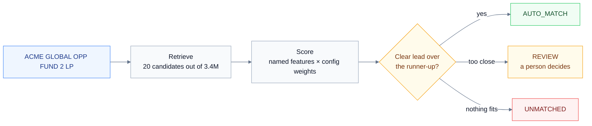
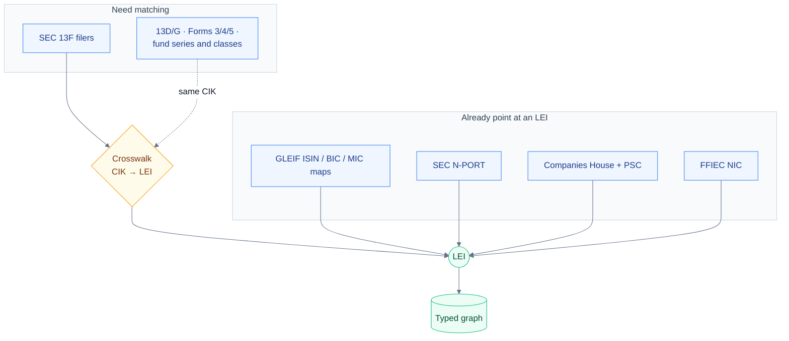
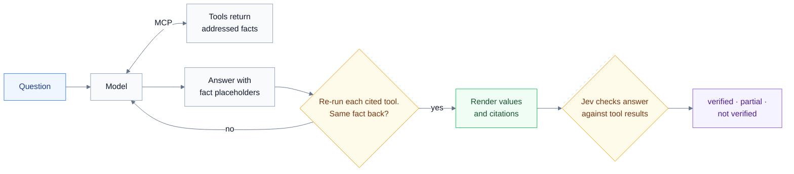
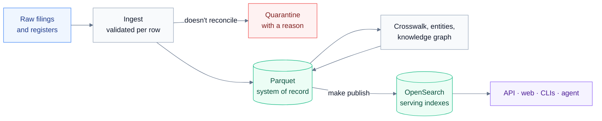

# Institutional Entity Intelligence

Ask five data sources about the same hedge fund and you get five spellings,
three identifier systems, and at least one record that looks identical but is
really the feeder fund, not the master. This project works out which legal
entity each messy record means, keeps the evidence for every link it makes, and
lets a person or an LLM agent answer questions about an institution while
pointing at the exact filing each number came from.

GLEIF's LEI register (3.4M legal entities) is the spine. SEC filings (13F,
N-PORT, 13D/G, Forms 3/4/5, Form ADV), the Federal Reserve's bank register and
UK Companies House attach to it.

## Why it's built this way

### Picking the wrong fund is worse than picking none

Nobody downstream re-checks a match that looks confident, so a wrong one
spreads quietly. The matcher is allowed to say "I can't tell these apart" and
hand the record to a person.



The score is a plain weighted sum of named signals: name similarity, country,
postcode, fund number, master/feeder. Every weight lives in `config/dev.yaml`,
so when a match looks wrong you can see which signal put it there, and a retune
is a config edit. The decision looks at the gap to the runner-up as well as the
top score, because two close high scores mean the input doesn't carry enough to
separate them.

### Every source goes through the same matcher

Some sources already state an LEI. The rest (13F filers, and through their CIKs
the 13D/G, insider and fund-structure records) go through a crosswalk that
calls the same matcher, never a per-source copy of it.



Each crosswalk decision keeps its score, runner-up and per-feature points. A
human review is its own dated record that takes precedence, so you can always
see what the machine thought and who overruled it. In the graph, "accounting
parent", "controls this bank", "owns 7% of the class" and "has significant
control" stay separate edge types. Folding them into one "parent" is how
ownership charts end up wrong.

### An answer never types a number

LLMs are good at sounding sure about figures they made up. So the agent's
model never writes a value itself; it cites one, and the citation is checked
before anyone sees it.



Every fact carries an address (source, document, locator, field). Computed
values, like a change in a 13F position between quarters, come from registered
formulas and travel with their inputs. A decision model then checks the
finished answer against the tool results. The badge it earns means "matches
what was retrieved", not "the filings are complete": 13F, for one, is only
ever the latest *reported* long US-equity holdings.

### Everything rebuilds from files



Every row passes through a pydantic model on the way in, so a malformed record
fails at ingest rather than turning up later in a profile. A 13F filing whose
holdings don't add up to its own summary page goes to quarantine instead of the
holdings table. Parquet holds everything; OpenSearch holds per-read copies
behind aliases, and it's all the runtime reads. Drop OpenSearch, run
`make index` and `make publish`, and nothing is lost.

## Quickstart

```bash
brew install libpostal
CFLAGS="-I/opt/homebrew/include" LDFLAGS="-L/opt/homebrew/lib" uv sync
cp .env.example .env   # OPENSEARCH_URL, plus OPENROUTER_API_KEY for the agent

make pipeline          # GLEIF + 13F ingest, index, validate, benchmark
make crosswalk-sec-13f && make build-entities && make build-knowledge-graph
make publish           # Parquet -> OpenSearch serving indexes
```

Then:

```bash
uv run python -m er.cli.match  --name "North Rock Capital" --country GB
uv run python -m er.cli.entity --name "Fred Alger Management" --country US
uv run python -m er.cli.family --name "Point72"
uv run python -m er.cli.ask --entity-id 254900ESP1ZKG7UNS007 --question "What is its registration status?"

make api                 # FastAPI on :8000, also the A2A agent endpoint
cd web && npm run dev    # the web UI
curl -s localhost:8000/.well-known/agent-card.json   # A2A agent card
```

```bash
make test                # unit tests, no live services, ~5s
make evaluate            # matcher vs. the full benchmark, needs OpenSearch
make evaluate-agent      # agent answers vs. config/agent_eval_cases.yaml
```

## More

- [`docs/data-sources.md`](docs/data-sources.md): what each source adds, how it
  reaches an LEI, what's loaded today, and where to get the raw files
- [`docs/running.md`](docs/running.md): every ingest, the serving indexes,
  reviewing match decisions, all the CLIs
- [`docs/agent.md`](docs/agent.md): the MCP tools, the A2A endpoint, the
  submission gate, Jev verification and the developer trace
- [`docs/architecture.md`](docs/architecture.md): the request path and repo layout
- [`docs/phases.md`](docs/phases.md): how it got here, with the real bugs
- [`experiments/`](experiments/README.md): retrieval and scoring changes, each
  with before/after numbers
- [`web/README.md`](web/README.md): the frontend
