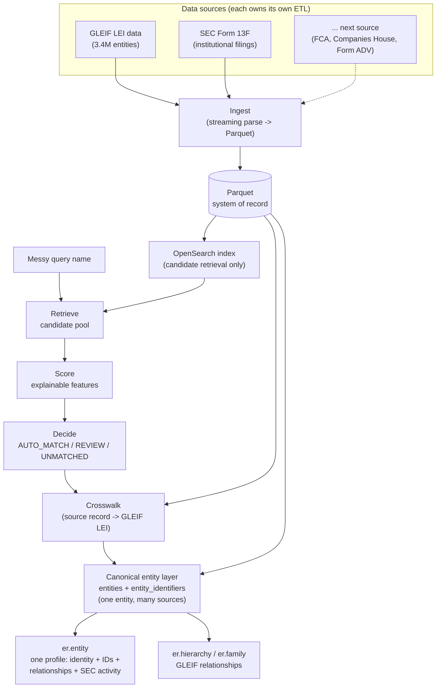

# Institutional Entity Intelligence

Entity-resolution platform anchored on GLEIF LEI data, extended with SEC filing
data (13F institutional holdings), built as a research substrate for
agentic-AI/entity-resolution work. Given a messy, real-world name for a fund or
manager, it identifies the correct legal entity, explains why, and links it to
other identifier systems and its institutional hierarchy.

OpenSearch is used only for candidate retrieval, never as the system of record —
canonical data always lives in Parquet.

## How it works



Every decision carries an evidence trail (which features fired, retrieval score
vs. match score, why a REVIEW/UNMATCHED wasn't confident enough) — never a silent
black box. See [`docs/architecture.md`](docs/architecture.md) for the full
request-level flow and [`docs/phases.md`](docs/phases.md) for the build history.

**Adding a new data source** (FCA, Companies House, Form ADV, ...) never touches
the canonical entity layer's code — you write that source's own `ingest.py`
under `src/er/datasources/<source>/`, a crosswalk resolving its records to a
GLEIF LEI via the existing `er.matching.matcher.match()`, and one SQL-returning
function in `src/er/entity/sources.py` pointing at your crosswalk's output. See
[`AGENTS.md`](AGENTS.md) for the exact steps.

## Quickstart

**Setup** (once):

```bash
brew install libpostal   # macOS; ships its own trained model data
CFLAGS="-I/opt/homebrew/include" LDFLAGS="-L/opt/homebrew/lib" uv sync
cp .env.example .env     # fill in OPENSEARCH_URL (OPENROUTER_API_KEY only needed for `er.cli.ask`/the web "Ask" section)
```

**Data pipeline** (once, or after refreshing raw source files):

```bash
make pipeline        # ingest all sources -> index -> validate -> benchmark
# or step by step:
make ingest-gleif     # GLEIF XML/CSV -> data/processed/*.parquet (~10-15 min)
make ingest-sec-13f   # SEC 13F bulk TSVs -> data/processed/*.parquet (~1 min)
make index            # entities -> OpenSearch (~20 min)
make validate         # sanity-check the processed tables
make benchmark        # data/benchmark/*.parquet (~1 sec, DuckDB)
```

**Day-to-day usage:**

```bash
# Raw candidate search - "what does OpenSearch think this could be"
uv run python -m er.cli.search --name "Sampo Oyj" --country FI

# Full resolution - retrieve + score + decide, with evidence
uv run python -m er.cli.match --name "North Rock Capital" --country GB

# The canonical entity profile - identity + every attached identifier (LEI,
# ISIN, SEC CIK, ...) + GLEIF relationships + SEC 13F activity, all one view
uv run python -m er.cli.entity --name "Fred Alger Management" --country US

# Relationship hierarchy - who manages it, what it's a sub-fund of
uv run python -m er.cli.hierarchy --name "Albacore Partners I Master Fund" --country IE --depth 2

# Brand/family discovery - which SET of legal entities make up this institution
uv run python -m er.cli.family --name "Point72"

# Crosswalk SEC 13F filers to GLEIF LEIs, then rebuild the canonical entity layer
make crosswalk-sec-13f
make build-entities

# Ask a question about an entity - a real MCP server (search_entity,
# get_entity_profile, get_relationship_hierarchy) wired to an OpenRouter model,
# answering with citations to deterministic Evidence records, not a document
# corpus. Every answer is then checked against its own tool results and closes
# with a verified / partially verified / not verified badge (see below).
# Requires OPENROUTER_API_KEY in .env.
uv run python -m er.cli.ask --entity-id 254900ESP1ZKG7UNS007 --question "What is its registration status?"
```

Every CLI lives under `er.cli` (`python -m er.cli.<name>`) - a deliberate
separation from the core ETL/entity-resolution packages, which never import
`argparse` or `rich` and stay usable from a future API or notebook without
dragging in terminal-presentation code. Each CLI also shows a progress
spinner while it fetches (rather than a blank screen) and reports how long it
took.

**Answer verification**: after the agent finishes, the answer and every tool
result behind it go to [TypeSafe's Jev](https://openrouter.ai/typesafe)
(`typesafe/jev-1.13`, OpenRouter's Decisions API) - a *decision* model rather
than a chat model: it answers a fixed set of typed questions in one forward
pass and returns a calibrated probability for each, so it cannot invent an
option or a confidence score the way a chat model asked to "rate this answer"
can. Four checks (claims match the records / no conflict with the records /
citations point at the right evidence / stays inside the retrieved data) plus an
overall verdict become one badge, via thresholds that live in
`config/dev.yaml`, not in code. It adds ~0.4-0.6s and ~$0.00002 per answer.

The badge says the answer matches what was retrieved - never that the records
are complete or correct. "Not checked" (the verifier was unreachable) is a
distinct state from "not verified" (it ran and the answer didn't hold up), and
renders grey rather than red. The thresholds were calibrated against a labelled
answer set rather than picked by feel; the readings, and a real bug the
measurement caught, are in
[`experiments/006-jev-answer-verification.md`](experiments/006-jev-answer-verification.md).

**Web UI**: a Next.js frontend (`web/`) over a thin FastAPI backend
(`src/er/api/`) - search by name/LEI/CUSIP, browse a depth-2 relationship tree,
click any node for its full profile, and ask it a question ("Ask" section in
the details panel) with citations resolved through an "Evidence layer" panel
instead of raw traces. Same core logic, a different view:

```bash
make api                 # FastAPI backend on :8000
cd web && npm run dev    # Next.js dev server
```

**Developer view**: the **Developer** button in the header docks a trace of
the last agent run on the right, as a tree - the run at the root, each model
turn under it, and under each turn the MCP tool calls (and the
`submit_answer` gate) that turn requested, then the Jev verification. Select
a node and its span opens beside the tree: for a model turn, the forced tool
choice, finish reason, provider, OpenRouter generation id, tokens and cost;
for a tool call, its arguments, evidence and result payload; for the gate, a
rejection and why; for the verifier, its raw readings. The root shows the
whole run as a timeline. Spans stream in live as the run happens, and a failed
run opens on the span that failed. A run that crashes
still leaves every step up to the one that killed it. Payload previews are
capped at 20k chars; a larger result (a deep relationship tree is ~1.2M)
arrives shape-preserved with long lists trimmed and each elision marked, and
the panel shows its true size. Traces come from `er.agent.trace` and are
opt-in on the API (`"trace": true` on `/api/ask/stream`); the web client
always asks for one so the panel can be opened *after* an answer looks wrong.

Separately, each tool result is capped at `agent.max_tool_result_chars`
(40k) *as sent to the model* - the full profile of a large issuer inlines
tens of thousands of ISINs (~7.6M chars), which OpenRouter rejects outright.
Over the cap, lists are trimmed with each elision marked and the model is told
to take counts from the evidence records; the trace shows when this happened.

See [`web/README.md`](web/README.md) for details.

Run `make help` for the full target list. All CLIs support `--country` (ISO
alpha-2 or a common alias like `UK`/`Cayman Islands`) and `--country-mode
soft|strict`.

## Testing

```bash
make test               # unit tests, no live services, ~5s
make evaluate            # scores the matcher against the full benchmark (~7 min,
                         # needs live OpenSearch) -> evaluation_report.json
```

`make test` covers every pure function (normalization, matcher features/scoring/
decisions, query construction, benchmark generation, graph traversal, brand-core
extraction) against synthetic fixtures — no live services required.
`run_benchmark` is the integration-level check against real data; a `make test`
pass alone doesn't confirm the live system behaves correctly.

## Repo layout

```
src/er/
├── cli/                    # every CLI (python -m er.cli.<name>) - argument
│                             parsing + rendering only, never core logic
├── datasources/<source>/   # one folder per data source, owns its own ETL end to end
├── normalisation/          # pure name/address/country normalization
├── retrieval/              # OpenSearch query building + candidate search
├── matching/               # features -> score -> decision (er.cli.match)
├── family/                 # brand/family discovery logic (er.cli.family)
├── graph/                  # relationship hierarchy logic (er.cli.hierarchy)
├── crosswalk/              # resolve another source's records to a GLEIF LEI
├── entity/                 # canonical entity layer: one entity, identifiers
│                             from every source (er.cli.entity) - see sources.py
│                             to add a new source's identifiers with one function
├── agent/                  # entity Q&A: a standalone MCP server (search_entity,
│                             get_entity_profile, get_relationship_hierarchy)
│                             plus an OpenRouter tool-calling orchestrator that
│                             is genuinely wired to it over the MCP protocol
│                             (er.cli.mcp_server, er.cli.ask) - every tool
│                             returns deterministic Evidence, not RAG chunks,
│                             and verifier.py checks the finished answer
│                             against those tool results with a decision model
├── evaluation/             # benchmark scoring + failure-analysis metrics
└── benchmark/              # auto-generated evaluation pairs

experiments/   # proof-backed retrieval/scoring experiments (VALIDATED/INVALIDATED)
docs/          # architecture detail, full phase-by-phase build history
```

None of the packages above import `argparse` or `rich` - every CLI's argument
parsing and terminal rendering lives in `src/er/cli/`, which imports *from*
those packages, never the other way around. This keeps core logic usable by a
future API/notebook without dragging in display code, and testable without a
live service.

More detail: [`AGENTS.md`](AGENTS.md) (repo map + design decisions for anyone —
human or agent — working in this codebase), [`docs/architecture.md`](docs/architecture.md),
[`docs/phases.md`](docs/phases.md), [`experiments/README.md`](experiments/README.md).
