# Data sources

GLEIF is the spine: every profile is an LEI, and every other source either
carries an identifier that lands on one directly, or reaches one through the
13F crosswalk's CIK → LEI decisions. Each source answers a different question,
and the graph keeps them as separate edge types: GLEIF accounting
consolidation, bank control, beneficial ownership and significant control are
never folded into one "parent".

| Source | What it is | What it adds | Reaches an LEI via | Loaded now |
|---|---|---|---|---|
| **GLEIF LEI** (`gleif`) | Global legal-entity register: Level 1 entities, Level 2 relationships and reporting exceptions | The entity universe and names matching runs against; accounting parent / ultimate parent, fund-manager, sub-fund, branch and successor edges; exceptions that say *why* a parent is missing | is the LEI | 3.4M entities, 669k relationships, 6.2M exceptions |
| GLEIF ISIN ↔ LEI (`gleif`) | GLEIF's issuer mapping file | ISIN identifiers on issuers; the positive pairs the benchmark is generated from | LEI in the file | 9.3M ISINs |
| GLEIF BIC / MIC / OpenCorporates mappings (`gleif`) | Registration-authority crosswalk files | SWIFT, market and company-register identifiers on an LEI | LEI in the file | 808k: 768k OpenCorporates, 39k BIC, 1k MIC |
| **SEC Form 13F** (`sec_13f`) | Quarterly long US-equity holdings of managers with $100M+ discretion | Who a manager is (filer CIK, name, address), latest reported holdings, position history by CUSIP; filings that don't reconcile go to quarantine | the only crosswalk: matcher resolves each filer CIK (AUTO_MATCH / REVIEW / UNMATCHED, human reviews on top) | 11.8k filings, 3.8M rows, 10.7k filers → 3,247 auto-matched, 853 for review |
| **SEC Schedule 13D/G** (`sec_13dg`) | Disclosures by anyone crossing 5% of a listed company's voting class | Beneficial-owner edges with percent of class, voting/dispositive power and event date; issuer ↔ CUSIP links | issuer and reporting-person CIKs, through the crosswalk | 21.7k ownership rows (structured XML, Dec 2024 onward) |
| **SEC insider filings** (`sec_insiders`) | Forms 3/4/5 by officers, directors and 10% owners | Insider-of edges (role, title) and their transactions | issuer CIK, through the crosswalk | 60k relationships, 128k transactions |
| **SEC series & class** (`sec_series_class`) | Registered investment-company register | Registrant → fund series → share class structure, with series and class IDs and tickers | registrant CIK, through the crosswalk | 43k classes, 19k series |
| SEC submissions (`sec_submissions`) | EDGAR company metadata for every CIK | Canonical CIK names, former names, addresses, SIC, tickers - better matching inputs for every CIK-keyed source | CIK | 993k CIKs |
| SEC N-PORT (`nport`) | Registered funds' portfolio reports (filed monthly, published quarterly) | Fund-level holdings beyond 13F (debt, derivatives, non-US); net assets and largest holdings on a fund's profile and as agent facts; registrant and series LEIs the filings state themselves | LEIs reported in the filing | 14.4k fund reports (2026 Q2 file), 5.3M holdings; latest report per fund on its profile |
| OpenFIGI (`openfigi`) | Bloomberg's open security-identifier mapping | FIGIs, tickers and security types for 13F CUSIPs, so a security is an entity of its own, never an identifier of its issuer | CUSIP → security node | partial until the ~3 h keyless fetch completes |
| SEC Form ADV (`sec_adv`) | Adviser registrations and brochure PDFs | Full-text, page-cited brochure search for the agent and the PDF viewer | CRD / SEC number | 996 brochures, 28.6k pages (Dec 2024; add more monthly zips for more) |
| Companies House + PSC (`companies_house`) | UK company register and persons with significant control | UK company numbers and status; significant-control edges with their nature of control (e.g. 25-50% of shares) | company number = GLEIF registration ID | 5.7M companies, 16.0M PSC records; 101.8k companies linked to an LEI |
| FFIEC NIC (`ffiec_nic`) | Federal Reserve register of US banks and holding companies | RSSD IDs; bank-control edges with percent ownership; mergers as successor edges | LEI the NIC record carries | not loaded |

Two consequences worth knowing. 13D/G, insider and fund-structure records
only appear on a profile when their CIK has been auto-matched (or reviewed) to
an LEI, so the crosswalk's coverage caps how much of them you see. And 13F is
"latest reported holdings", never a whole portfolio: it excludes shorts,
derivatives, non-US securities, private investments and sub-threshold positions.

## How the sources join

What each source carries, what it doesn't, and the key it joins on. A dashed
line means there is no shared key and the link has to be made some other way:
13F filers by name match, Form ADV not at all yet.

```mermaid
%%{init: {"theme": "base", "themeVariables": {"primaryColor": "#EFF6FF", "primaryTextColor": "#0F172A", "primaryBorderColor": "#3B82F6", "lineColor": "#64748B", "tertiaryColor": "#F8FAFC", "attributeBackgroundColorOdd": "#FFFFFF", "attributeBackgroundColorEven": "#F8FAFC"}}}%%
erDiagram
    GLEIF_LEI {
        string lei PK "the global spine"
        string legal_name "thousands of near-identical fund names"
        string registration_id "local register number"
        string accounting_parent "consolidation, not control or ownership"
        string exception_reason "why a parent is missing"
        missing cik "no SEC identifier on the record"
        missing holdings "no holdings, stakes or filings"
    }
    GLEIF_ISIN_MAP {
        string isin PK
        string lei FK "stated by GLEIF"
    }
    SEC_13F {
        string filer_cik PK "SEC-only number"
        string filer_name "free text, renamed over time"
        string cusip FK "a security, not its issuer"
        string issuer_name "free text"
        number value "in thousands before 3 Jan 2023"
        string put_call "options, not long positions"
        missing lei "never reported"
        missing group_parent "one group files under many CIKs"
    }
    SEC_SUBMISSIONS {
        string cik PK
        string name "plus former names - helps the match"
        string address
        string sic
        missing lei "no LEI field"
    }
    SEC_13DG {
        string issuer_cik FK
        string issuer_cusip FK
        string reporting_person_cik FK "absent on 13.5k of 21.7k rows"
        number percent_of_class
        number voting_power
        date event_date "structured XML only since Dec 2024"
    }
    SEC_INSIDERS {
        string owner_cik FK "mostly people - no LEI exists"
        string issuer_cik FK
        string role "officer, director, 10 pct owner"
    }
    SEC_SERIES_CLASS {
        string registrant_cik FK
        string series_id PK "SEC-only"
        string class_id "SEC-only"
        string ticker
        missing lei "no LEI"
    }
    SEC_NPORT {
        string registrant_cik FK
        string registrant_lei FK "stated by the filer"
        string series_id FK
        string series_lei FK "13537 of 13548 found in GLEIF"
        string issuer_cusip FK
        string issuer_lei FK
        number net_assets "registered funds only"
    }
    OPENFIGI {
        string figi PK
        string cusip FK
        string ticker
        string security_type
        missing issuer_lei "describes the security, not who issued it"
    }
    SEC_ADV {
        string crd_number PK "carried by no other source here"
        string firm_name
        text page_text "unstructured PDF pages"
        missing cik "no CIK or LEI"
    }
    COMPANIES_HOUSE {
        string company_number PK "UK-only"
        string company_name
        string status
        missing lei "equals a GLEIF registration ID for 101.8k of 5.7M"
    }
    UK_PSC {
        string company_number FK
        string name "individuals have no identifier"
        string natures_of_control "e.g. 25-50 pct of shares"
        date ceased_on
    }
    FFIEC_NIC {
        string rssd_id PK "Fed-only"
        string lei "only on some records"
        string parent_rssd_id "bank control, with equity pct"
        string successor_rssd_id "mergers"
    }

    GLEIF_ISIN_MAP }o--|| GLEIF_LEI : "LEI"
    SEC_13F }o..o| GLEIF_LEI : "NO SHARED KEY - CIK resolved by name match"
    SEC_13F }o--o| SEC_SUBMISSIONS : "CIK"
    SEC_13F }o--o| OPENFIGI : "CUSIP"
    SEC_13DG }o--o| SEC_SUBMISSIONS : "issuer CIK"
    SEC_INSIDERS }o--o| SEC_SUBMISSIONS : "issuer CIK"
    SEC_SERIES_CLASS }o--o| SEC_SUBMISSIONS : "registrant CIK"
    SEC_NPORT }o--o| SEC_SERIES_CLASS : "series ID"
    SEC_NPORT }o--o| GLEIF_LEI : "LEIs the filing states"
    SEC_ADV |o..o| GLEIF_LEI : "NO KEY - CRD appears nowhere else"
    COMPANIES_HOUSE |o..o| GLEIF_LEI : "registration ID, partial"
    UK_PSC }o--|| COMPANIES_HOUSE : "company number"
    FFIEC_NIC |o..o| GLEIF_LEI : "LEI, only on some records"
```

## Getting the raw files

Raw files the scripted ingests don't fetch themselves: N-PORT from SEC's
[Form N-PORT data sets](https://www.sec.gov/data-research/sec-markets-data/form-n-port-data-sets),
ADV brochures from SEC's [Form ADV data](https://www.sec.gov/foia-services/frequently-requested-documents/form-adv-data)
page, Companies House from [download.companieshouse.gov.uk](https://download.companieshouse.gov.uk/en_output.html)
(and its [PSC snapshot](https://download.companieshouse.gov.uk/en_pscdata.html)),
GLEIF's BIC/MIC/OpenCorporates mappings from its
[mapping API](https://mapping.gleif.org/api/v2/bic-lei/latest) into `data/raw` (parsed by
`make ingest-gleif`), and FFIEC NIC by hand from
[ffiec.gov](https://www.ffiec.gov/npw/FinancialReport/DataDownload), which puts a CAPTCHA
in front of scripts.
